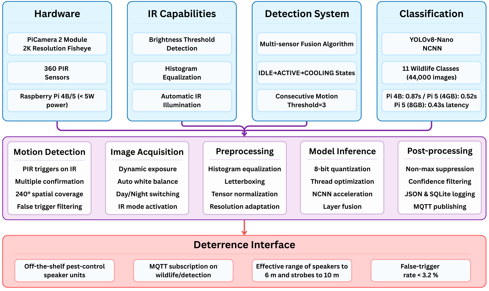

# InvisibleFence

<h1 align="center">
 <a href="https://justchugh.github.io/InvisibleFence/" style="text-decoration: none; color: inherit;">
   InvisibleFence: Non-Lethal Edge-Optimized AI for Human Wildlife Coexistence and Crop Protection
 </a>
</h1>

<p align="center">
 <a href="https://github.com/justchugh/animal_coexist">
   
 </a>
 &nbsp;&nbsp;&nbsp;
 <a href="https://github.com/justchugh/InvisibleFence.github.io">
   
 </a>
 &nbsp;&nbsp;&nbsp;
 <a href="https://youtu.be/6DLVsTkO47E">
   
 </a>
 &nbsp;&nbsp;&nbsp;
 <a href="assets/InvisibleFence_Demo.pdf">
   
 </a>
</p>

<p align="center">
   &nbsp;&nbsp;&nbsp;
   &nbsp;&nbsp;&nbsp;
  
</p>

> **ACM MobiSys 2025 Demo** - *"InvisibleFence: Non-Lethal Edge-Optimized AI for Human Wildlife Coexistence and Crop Protection"*

---

## 📋 Table of Contents

- [**Overview**](#overview)
- [**Key Features**](#key-features)
- [**System Architecture**](#system-architecture)
- [**Hardware Components**](#hardware-components)
- [**Performance**](#performance)
- [**Dataset**](#dataset)
- [**Demo**](#demo)
- [**Installation**](#installation)
- [**Citation**](#citation)
- [**Team**](#team)
- [**Acknowledgments**](#acknowledgments)

---

## Overview

InvisibleFence is an edge-optimized AI framework for detecting wildlife and providing targeted, non-lethal deterrence to protect crops and residential areas. By combining computer vision with modular deterrent devices, it addresses the limitations of traditional wildlife management approaches.

### 🎯 Problem
- Ineffective deterrents (rodenticides, fences, lethal traps)
- High false-positive rates in motion sensors
- Wildlife habituation to generic deterrents
- Ecological damage from traditional methods

### 💡 Solution
- AI-powered species identification (86.7% mAP)
- Edge computing on Raspberry Pi 5
- Modular deterrent system (sound, light, spray)
- Human/pet safety with automatic suppression

---

## Key Features

| Feature | Description |
|---------|-------------|
| **🧠 Edge Intelligence** | 2K video processed in <0.8s on embedded hardware |
| **🐾 Species-Specific** | 11 wildlife species detection with targeted responses |
| **⚡ Power Efficient** | Continuous 24/7 operation under 5W |
| **🔒 Privacy-First** | Fully cloud-free, MQTT-based local communication |
| **🛡️ Human Safety** | Auto-suppresses deterrents when humans/pets detected |

---

## System Architecture

<p align="center">
  
</p>

### Components

1. **Vision Pod**
   - 3D-printed weatherproof enclosure
   - 2560×1440 IR camera with 174° fisheye lens
   - 240° tri-PIR motion sensor array
   - Raspberry Pi 5 running YOLOv8-Nano NCNN
   
2. **Deterrent Modules**
   - Sound Pod: 6-speaker ultrasonic array
   - Light Module: Programmable LED strobes
   - Spray System: Water/scent deterrents
   - MQTT-controlled activation

---

## Hardware Components

| Component | Specification |
|-----------|---------------|
| **Processor** | Raspberry Pi 5 (8GB RAM) |
| **Camera** | 2K IR Camera, 174° FOV |
| **Sensors** | 240° Tri-PIR Array |
| **Model** | YOLOv8-Nano NCNN (11.7 MB) |
| **Power** | <5W continuous operation |
| **Communication** | MQTT over local network |

---

## Performance

### 📊 Model Benchmarks

| Model | Precision | Recall | F1 | mAP | Size (MB) | Time (s) |
|-------|-----------|--------|-------|-----|-----------|----------|
| YOLOv7-416 | 0.855 | 0.802 | 0.82 | 0.84 | 12.3 | 692.38 |
| YOLOv7-640 | 0.856 | 0.811 | 0.83 | 0.855 | 12.3 | 699.52 |
| **YOLOv8-N NCNN** | **0.868** | **0.811** | **0.83** | **0.867** | **11.7** | **157.09** |
| YOLOv11-S | 0.889 | 0.804 | 0.87 | 0.893 | 19.2 | 1884.12 |

### 🎯 Species Detection Accuracy
- Deer: 0.87
- Raccoon: 0.95
- Rabbit: 0.90

---

## Dataset

Our comprehensive dataset includes:
- **44,000** real-world images
- **11** wildlife species classes
- Day/night captures with IR illumination
- Field-collected from farms and backyards

### Species Coverage
Deer, fox, raccoon, rabbit, birds, squirrel, and other common garden intruders

**To request dataset access**, please email: schugh1@umbc.edu

---

## Demo

Watch our live demonstration: [https://youtu.be/6DLVsTkO47E](https://youtu.be/6DLVsTkO47E)

The demo shows:
- Real-time wildlife detection
- Automatic human/pet safety suppression
- MQTT-triggered deterrent activation
- Live confidence scores and distance estimation

---

## Installation

### Prerequisites
- Raspberry Pi 5 (8GB recommended)
- Python 3.8+
- MQTT Broker (Mosquitto recommended)

### Setup
```bash
# Clone repository
git clone https://github.com/justchugh/InvisibleFence.git
cd InvisibleFence

# Install dependencies
pip install -r requirements.txt

# Configure MQTT settings
cp config.example.json config.json
# Edit config.json with your MQTT broker details

# Run the Vision Pod
python vision_pod.py

# Run deterrent modules (on separate devices)
python sound_pod.py
```

---

## Citation

If you use this work in your research, please cite:

```bibtex
@inproceedings{invisiblefence2025,
  author = {Snehalraj Chugh and Milind Rampure and Elijah Polyakov and Bipendra Basnyat and Nirmalya Roy},
  title = {Demo: InvisibleFence: Non-Lethal Edge-Optimized AI for Human Wildlife Coexistence and Crop Protection},
  booktitle = {The 23rd Annual International Conference on Mobile Systems, Applications and Services (MobiSys '25)},
  year = {2025},
  month = {June},
  days = {23-27},
  location = {Anaheim, CA, USA},
  publisher = {ACM},
  doi = {10.1145/3711875.3734379}
}
```

---

## Team

<div align="center">

|  |  |  |  |  |
|:---:|:---:|:---:|:---:|:---:|
| [**Snehalraj Chugh**](https://justchugh.github.io) | [**Milind Rampure**](https://linkedin.com/in/milind-rampure) | [**Elijah Polyakov**](https://linkedin.com/in/elijah-polyakov) | [**Bipendra Basnyat**](https://linkedin.com/in/bipendra-basnyat) | [**Nirmalya Roy**](https://mpsc.umbc.edu/nroy) |

</div>

---

## Acknowledgments

This work has been partially supported by:
- NSF CAREER Award #1750936
- NSF CNS EAGER Grant #2233879
- NSF REU Site Grant #2050999
- NSF I-Corps Grant #2502886
- UMBC FEAT and TCF Grants

---

<p align="center">
  
</p>
